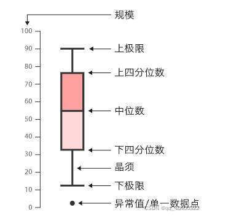
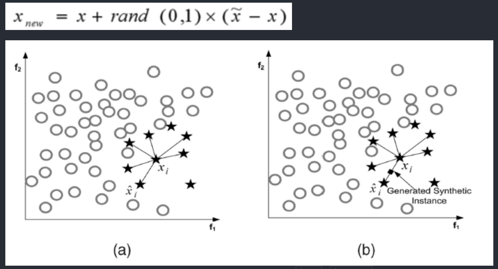

# 项目背景及介绍
## 任务描述：
    随着电信行业的不断发展，运营商们越来越重视如何扩大其客户群体。据研究，获取新客户所需的成本远高于保留现有客户的成本，因此为了满足在激烈竞争中的优势，保留现有客户成为一大挑战。对电信行业而言，可以通过数据挖掘等方式来分析可能影响客户决策的各种因素，以预测他们是否会产生流失（停用服务、转投其他运营商等）。

## 数据集：
    数据集一共提供了7043条用户样本，每条样本包含21列属性，由多个维度的客户信息以及用户是否最终流失的标签组成，客户信息具体如下：
    基本信息：包括性别、年龄、经济情况、入网时间等；
    开通业务信息：包括是否开通电话业务、互联网业务、网络电视业务、技术支持业务等；
    签署的合约信息：包括合同年限、付款方式、每月费用、总费用等。

## 评测：
    电信用户流失预测中，运营商最为关心的是客户的召回率，即在真正流失的样本中，我们预测到多少条样本。其策略是宁可把未流失的客户预测为流失客户而进行多余的留客行为，也不漏掉任何一名真正流失的客户。

## 思路

    数据预处理、可视化分析、特征工程、模型预测、模型评估、分析与决策。

## 数据字段介绍
21列原始属性中，除了最后一列Churn表示该数据集的目标变量（即标签列）外，
其余20列按照原始数据集中的排列顺序刚好可以分为三类特征群：即客户的基本信息、开通业务信息、签署的合约信息。每一列具体信息如下：

<table>
<thead>
<tr>
<th>$字段名$</th>
<th>$字段描述$</th>
<th>$数据类型$</th>
<th>$字段取值$</th>
<th>$所属特征群或标签$</th>
</tr>
</thead>
<tbody><tr>
<td>customerID</td>
<td>客户ID</td>
<td>字符串</td>
<td>7043个不重复取值</td>
<td>基本信息</td>
</tr>
<tr>
<td>gender</td>
<td>性别</td>
<td>字符串</td>
<td>Male, Female</td>
<td>基本信息</td>
</tr>
<tr>
<td>SeniorCitizen</td>
<td>是否为老年人</td>
<td>整型</td>
<td>1, 0</td>
<td>基本信息</td>
</tr>
<tr>
<td>Partner</td>
<td>是否有配偶</td>
<td>字符串</td>
<td>Yes, No</td>
<td>基本信息</td>
</tr>
<tr>
<td>Dependents</td>
<td>是否有家属</td>
<td>字符串</td>
<td>Yes, No</td>
<td>基本信息</td>
</tr>
<tr>
<td>tenure</td>
<td>入网月数</td>
<td>整型</td>
<td>0～72</td>
<td>基本信息</td>
</tr>
<tr>
<td>PhoneService</td>
<td>是否开通电话业务</td>
<td>字符串</td>
<td>Yes, No</td>
<td>开通业务信息</td>
</tr>
<tr>
<td>MultipleLines</td>
<td>是否开通多线业务</td>
<td>字符串</td>
<td>Yes, No, No phone service</td>
<td>开通业务信息</td>
</tr>
<tr>
<td>InternetService</td>
<td>是否开通互联网业务</td>
<td>字符串</td>
<td>DSL数字网络, Fiber optic光纤网络, No</td>
<td>开通业务信息</td>
</tr>
<tr>
<td>OnlineSecurity</td>
<td>是否开通在线安全业务</td>
<td>字符串</td>
<td>Yes, No, No internet service</td>
<td>开通业务信息</td>
</tr>
<tr>
<td>OnlineBackup</td>
<td>是否开通在线备份业务</td>
<td>字符串</td>
<td>Yes, No, No internet service</td>
<td>开通业务信息</td>
</tr>
<tr>
<td>DeviceProtection</td>
<td>是否开通设备保护业务</td>
<td>字符串</td>
<td>Yes, No, No internet service</td>
<td>开通业务信息</td>
</tr>
<tr>
<td>TechSupport</td>
<td>是否开通技术支持业务</td>
<td>字符串</td>
<td>Yes, No, No internet service</td>
<td>开通业务信息</td>
</tr>
<tr>
<td>StreamingTV</td>
<td>是否开通网络电视业务</td>
<td>字符串</td>
<td>Yes, No, No internet service</td>
<td>开通业务信息</td>
</tr>
<tr>
<td>StreamingMovies</td>
<td>是否开通网络电影业务</td>
<td>字符串</td>
<td>Yes, No, No internet service</td>
<td>开通业务信息</td>
</tr>
<tr>
<td>Contract</td>
<td>合约期限</td>
<td>字符串</td>
<td>Month-to-month, One year, Two year</td>
<td>签署的合约信息</td>
</tr>
<tr>
<td>PaperlessBilling</td>
<td>是否采用电子结算</td>
<td>字符串</td>
<td>Yes, No</td>
<td>签署的合约信息</td>
</tr>
<tr>
<td>PaymentMethod</td>
<td>付款方式</td>
<td>字符串</td>
<td>Bank transfer (automatic), Credit card (automatic), Electronic check, Mailed check</td>
<td>签署的合约信息</td>
</tr>
<tr>
<td>MonthlyCharges</td>
<td>每月费用</td>
<td>浮点型</td>
<td>18.25～118.75</td>
<td>签署的合约信息</td>
</tr>
<tr>
<td>TotalCharges</td>
<td>总费用</td>
<td>字符串</td>
<td>有部分空格字符，除此之外的字符串对应的浮点数取值范围在18.80～8684.80之间</td>
<td>签署的合约信息</td>
</tr>
<tr>
<td>Churn</td>
<td>客户是否流失</td>
<td>字符串</td>
<td>Yes, No</td>
<td>目标变量</td>
</tr>
</tbody></table>

##  箱型图介绍
一、概念介绍
    箱型图（box-plot)，又称为箱线图，盒型图，盒须图。在数据探索阶段或者描述性分析过程中，我们常常用于展示多类连续型数据的数值分布情况，便于类间对比和快速识别异常值。
    在一幅箱型图中，一个连续数值序列构成一个盒子，如下所示。

    每一个盒子主要展示的是数据的上四分位数Q1(25%)，中位数（50%)，下四分位数Q3（75%)。划分异常值的界限我们称为上下极限，其离Q1,Q3分别是1.5IQR（IQR=Q3-Q1，称作四分位距）的距离，在上下极限之外的点，我们称为异常点。异常值在不同场景中受到不同的重视.

# 数据类别不均衡处理
在可视化环节中，我们观察到正负样本的比例大概在1:3左右，因此需要对正样本进行升采样或对负样本进行降采样。考虑到本数据集仅有7千多条样本，不适合采用降采样，进行升采样更为合理，本案例采用升采样中较为成熟的SMOTE方法生成更多的正样本。
# 补充知识：SMOTE方法

SMOTE（Synthetic Minority Oversampling Technique），合成少数类过采样技术．它是基于随机过采样算法的一种改进方案，由于随机过采样采取简单复制样本的策略来增加少数类样本，这样容易产生模型过拟合的问题，即使得模型学习到的信息过于特别(Specific)而不够泛化(General)，SMOTE算法的基本思想是对少数类样本进行分析并根据少数类样本人工合成新样本添加到数据集中，具体如下图所示，算法流程如下。

<ol>
    <li>对于少数类中每一个样本x，以欧氏距离为标准计算它到少数类样本集中所有样本的距离，得到其k近邻。</li>
<li>根据样本不平衡比例设置一个采样比例以确定采样倍率N，对于每一个少数类样本x，从其k近邻中随机选择若干个样本，假设选择的近邻为xn。</li>
<li>对于每一个随机选出的近邻xn，分别与原样本按照如下的公式构建新的样本。</li>
</ol>

# 分析与决策

## 在可视化阶段，可以发现较易流失的客户在各个特征的用户画像如下：

- 基本信息
- - 老年人
- - 未婚
- - 无家属
- - 入网时间不长，特别是2个月之内

- 开通业务
- - 开通光纤网络
- - 未开通在线安全、在线备份、设备保护、技术支持等互联网增值业务

- 签订合约
- - 合约期限较短，特别是逐月付费客户最易流失
- - 采用电子结算（多为按月支付）
- - 采用电子支票
- - 每月费用较高，特别是70～110之间
- - 总费用较低（侧面反应入网时间较短）

## 根据用户画像，可以从各个方面推出相应活动以求留下可能流失的客户：

- - 对老人推出亲情套餐等优惠
- - 对未婚、无家属的客户推出暖心套餐等优惠
- - 对新入网用户提供一定时期的优惠活动，直至客户到达稳定期
- - 提高电话服务、光纤网络、网络电视、网络电影等的客户体验，尝试提高用户的留存率，避免客户流失
- - 对能够帮助客户留存的在线安全、在线备份、设备保护、技术支持等互联网增值业务，加大宣传推广力度
- - 对逐月付费用户推出年费优惠活动
- - 对使用电子结算、电子支票的客户，推出其他支付方式的优惠活动
- - 对每月费用在70～110之间推出一定的优惠活动

